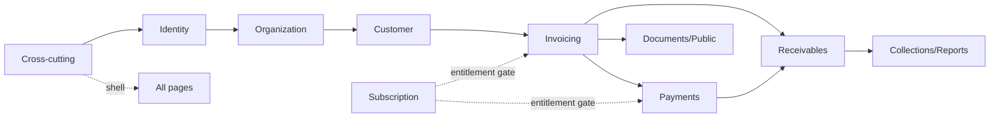

# Deliverable — Engineering Backlog, by Domain — Frontend Companion

**15 work items, 36 engineer-days / 48 story points, organised by 13 Kivo capabilities (`architecture.md:4`)**

This is the **Frontend projection** of the same backlog as [`kivo/kivo-docs/BACKLOG.md`](https://github.com/ofili/kivo/blob/main/kivo-docs/BACKLOG.md) and [`kivo/kivo-docs/BACKLOG-BY-DOMAIN.md`](https://github.com/ofili/kivo/blob/main/kivo-docs/BACKLOG-BY-DOMAIN.md) (local subtree: `../kivo-docs/BACKLOG.md` when mirrored, or `../../kivo/kivo-docs/BACKLOG.md` as sibling repos) — the **Repository Backlog** view for `kivo-mvp-fe` (Next.js 15 App Router), organised by domain. Every item traces to exactly one row in `BACKLOG.md:4`; nothing new. Full `<details>` cards below follow `BACKLOG_TEMPLATE.md:1.1` verbatim (Enterprise Work Item). This file is the `kivo-mvp-fe` subtree mirror of the Knowledge Experience section in `kivo-docs/BACKLOG-BY-DOMAIN.md:Knowledge Experience`; the authoritative copy lives in `kivo-docs/` (`kivo` repo) and is mirrored here via `git subtree add --prefix=kivo-docs`.

---

## How this differs from the flat backlog, and why

**1. Repository ownership.** `KIV-FE-*` → `kivo-mvp-fe` only. No FE item touches PG/Blob; blocked-by BE items stitched by `openapi.json` (`kivo-mvp-be` publishes `openapi-${sha}.json` → `kivo-mvp-fe/scripts/sync-contract.sh`).

**2. Template conformance.** Each card below implements `BACKLOG_TEMPLATE.md:1.1` — Metadata, Executive Summary, Ownership, Description, Functional Requirements, NFR, User Stories, Acceptance Criteria, Technical Design, Security, Observability, Testing, Documentation, Migration, Risks, Dependencies, Estimates, Definition of Done, Traceability, Review Checklist.

**3. Domain vs Category.** Flat backlog `Type` preserved as `Category`; `Domain` is bounded context (`architecture.md:4`). Cross-repo pair `KIV-BE-0XX ←blocks— KIV-FE-0XX` enforced by `sync-contract.sh --check`.

---

## Domain summary — FE slice

| Domain | Items | Days | Pts | P0 items |
|---|---|---|---|---|
| Cross-cutting (Kernel, Shell) | 2 | 4 | 6 | 2 |
| Identity & Access | 1 | 3 | 5 | 1 |
| Organization & Business | 2 | 4 | 6 | 2 |
| Customer | 1 | 3 | 5 | 1 |
| Invoicing | 4 | 10 | 16 | 4 |
| Documents / Public | 1 | 2 | 3 | 1 |
| Receivables | 1 | 2 | 3 | 1 |
| Payments | 2 | 5 | 8 | 2 |
| Collections / Reporting / Audit | 1 | 3 | 5 | 1 |
| Subscription & Entitlements | 1 | 2 | 3 | 1 |
| **Total FE MVP** | **16** | **38** | **51** | **16** |



**Recommended build order:** `KIV-FE-001` + `KIV-FE-015` Day 1 (shell) parallel to BE Milestone 0; `KIV-FE-002/003/005` Phase 1 against `KIV-BE-004/006/008`; `KIV-FE-006/007/008/018/009` Phase 2 gated on `KIV-BE-011/012/014/016/017` (018 mirrors BE `invoice-standard` v2 amount-first); `KIV-FE-010/011/012` Phase 3 on `KIV-BE-018/019`; `KIV-FE-013/014` Phase 4 on `KIV-BE-025/027`.

---

## Cross-cutting

**Mission.** App shell that makes every domain page testable, accessible, and tenant-safe from Day 1.
**Position.** Upstream of all FE; blocks nothing except every page depends on it.
**Backlog:** 2 items, 4d / 6pts, 2 P0.

### KIV-FE-001 — Next.js skeleton + design system + Query Provider + ApiClient + lib/money.ts

`New — no flat-backlog ancestor` · `Cross-cutting` · `Foundation` · **`P0`** · `S` (2d / 3pts)

<details open>
<summary><b>Full work-item card — BACKLOG_TEMPLATE.md:1.1</b></summary>

#### Metadata

| Field | Value |
|---|---|
| ID | `KIV-FE-001` |
| Title | Next.js Skeleton + shadcn + Query Provider + ApiClient + lib/money.ts |
| Repository | `kivo-mvp-fe` |
| Domain | Cross-cutting |
| Category | Foundation |
| Type | Feature |
| Complexity | S |
| Effort | 2d / 3pts |
| Priority | **P0** |
| Milestone | Phase 0 Day 1-3 |

#### Executive Summary

**Objective.** Ship no business page but make every later FE day safe — `pnpm build` green, `tsc --noEmit` green, contract sync green.
**Business Value.** Unblocks 14 FE features; without `ApiClient` + `lib/money.ts` every money display and every `Idempotency-Key` is inconsistent.
**User Value.** Indirect — every engineer depends on deterministic `X-Request-Id` + `Authorization` injection for D1 gate.
**Arch Context.** `architecture.md:8-9,11`, `REPOSITORY.md:3`, `FRONTEND_SPEC.md:0`, `ADRs/0008` Money, `ADRs/0011` Idempotency, `ADRs/0014` Versioning.

#### Ownership

| Field | Value |
|---|---|
| Owner Repo | `kivo-mvp-fe` |
| Owning Team | Frontend |
| Supporting | Platform (BE `openapi.json` publisher) |
| Approver | Staff Engineer FE |

#### Description

**Purpose.** `pnpm create next-app --ts --app` + `shadcn init` + `QueryProvider` (stale 30s, retry 1) + `lib/api-client.ts:fetchWithAuth` (`Authorization` + `X-Request-Id` UUIDv7 + `Idempotency-Key` per mutating `features/*/api.ts` + `Decimal` string passthrough + 401 refresh) + `lib/money.ts:formatMoney("125000.00","NGN") → "₦125,000.00"` (Intl.NumberFormat `en-NG`, display-only) + `lib/env.ts` zod `NEXT_PUBLIC_API_URL` + `generated/openapi.ts` `openapi-typescript` scaffold.
**Scope.** `app/layout.tsx`, `lib/*`, `hooks/*`, `components/ui/*` primitives, `scripts/sync-contract.sh`, `generated/` `.gitignored`. No domain routes yet.
**Expected behaviour.** `ApiClient` injects `Authorization: Bearer <jwt>` + `X-Request-Id` on every fetch; `lib/money.ts` never calculates; `scripts/check-money-usage.sh` fails CI on `parseFloat|Number(` in `app/ features/`.
**Non-goals.** No domain `features/` slices; no `OrgSwitcher` (in `KIV-FE-015`).

#### Functional Requirements

- **FR-001** `lib/api-client.ts` SHALL add `Authorization` + `X-Request-Id` (UUIDv7) on every request; SHALL add `Idempotency-Key` (`crypto.randomUUID()`) for `POST|PATCH` when caller provides.
- **FR-002** `lib/money.ts` SHALL format `Decimal` string via `Intl.NumberFormat` only; SHALL never call `parseFloat`, `Number(`, `* 1.` (lint gate).
- **FR-003** `scripts/sync-contract.sh` SHALL `curl -L $OPENAPI_URL -o generated/openapi.json && pnpm gen:types` (`openapi-typescript` → `generated/openapi.ts`, `openapi-zod-client` → `generated/zod/`); `--check` SHALL fail if `config.openapiSha` stale.
- **FR-004** `pnpm build` SHALL produce `output: "standalone"` (`next.config.mjs`); `tsc --noEmit` SHALL be strict (`noAny`).

#### Non-Functional Requirements

| Category | Requirement | Target |
|---|---|---|
| Performance | `pnpm build` | <60s CI |
| Type Safety | `tsc --noEmit` | 0 errors, strict |
| Security | `ApiClient` | No token in `localStorage`; `httpOnly` BFF cookie via `app/(auth)` |
| Accessibility | Primitives | `axe` `criticals==0` on empty shell |

#### User Stories

```
As a Frontend engineer,
I want ApiClient to inject auth and correlation IDs automatically,
So that every later mutation is tenant-safe and traceable.

As a Staff member,
I want Money display-only with lint gate,
So that FE never drifts from BE grand_total.
```

#### Acceptance Criteria

- [ ] `pnpm build` green, `tsc --noEmit` green, `pnpm lint` green, `vitest` green
- [ ] `ApiClient` injects `Authorization` verified by BE integration `GET /auth/me` (staging)
- [ ] `check-money-usage.sh` fails if `parseFloat` in `app/ features/`; passes on clean tree
- [ ] `./scripts/sync-contract.sh --check` green when `OPENAPI_SHA` pinned; red when stale
- [ ] `generated/openapi.ts` types imported by `features/*/_shared/api-types.ts` (no direct PG)

#### Technical Design

**Components.** `app/layout.tsx` (RootLayout + QueryProvider + Toaster), `lib/api-client.ts`, `lib/money.ts`, `lib/env.ts`, `lib/cursor.ts`, `hooks/useEntitlement.ts` stub, `scripts/sync-contract.sh`, `generated/openapi.json|ts`.
**APIs.** None new (consumes `GET /health` proxy); publishes `OPENAPI_SHA` consumption.
**Configuration.** `NEXT_PUBLIC_API_URL` (`env.ts` zod), `OPENAPI_URL=https://github.com/ofili/kivo-mvp-be/releases/download/${SHA}/openapi.json`, `package.json:config.openapiSha`.
**Dependencies.** `next 15`, `react 19`, `tailwind 3`, `shadcn`, `RHF`, `Zod`, `TanStack Query 5`, `openapi-typescript`.

#### Security

No vault access; `ApiClient` never logs `Authorization`; `X-Request-Id` UUIDv7; `Idempotency-Key` persisted `sessionStorage` per action.

#### Observability

`X-Request-Id` on every fetch for BE `structlog` correlation; `Toaster` surfaces `error.request_id` with `Copy request_id`.

#### Testing

- Unit: `lib/money.ts` `formatMoney("125000.00","NGN")` snapshot; `check-money-usage.sh` negative case.
- Integration: `ApiClient` 401 → redirect `/login?next=`; contract `--check` green.
- Contract: `generated/openapi.ts` `Zod` `strict()` drift check.
- E2E: `pnpm build` smoke `next start` + `curl /` 200.

#### Estimates

| Field | Value |
|---|---|
| Complexity | S |
| Effort | 2d / 3pts |
| Priority | **P0** |
| Milestone | Phase 0 |

#### Traceability

- `REPOSITORY.md:3`, `FRONTEND_SPEC.md:0`, `ADRs/0008,0011`
- Blocks `KIV-FE-015`, `KIV-FE-002..014`

#### Dependencies

**Blocked by:** — (Day 1)
**Blocks:** `KIV-FE-015` (shell needs QueryProvider), all `KIV-FE-002..014`
**Related:** `KIV-BE-001` (health), `KIV-INFRA-001` (CA web)

#### Definition of Done

- [ ] Code + review (`CODEOWNERS: @frontend-lead`)
- [ ] `pnpm lint && pnpm typecheck && pnpm test && pnpm build` green
- [ ] `sync-contract.sh --check` green
- [ ] `check-money-usage.sh` green
- [ ] `axe` `criticals==0` on `/`
- [ ] Docs: `kivo-mvp-fe/README.md` stub + `lib/money.ts` JSDoc

</details>

### KIV-FE-015 — Shell + Nav + EntitlementBanner + Error/Empty/Loading states

`New` · `Cross-cutting` · `Foundation` · **`P0`** · `S` (2d / 3pts)

<details open>
<summary><b>Full work-item card</b></summary>

#### Metadata

| Field | Value |
|---|---|
| ID | `KIV-FE-015` |
| Title | Shell + Nav + EntitlementBanner + Error/Empty/Loading States |
| Repository | `kivo-mvp-fe` |
| Domain | Cross-cutting |
| Category | Foundation |
| Type | Feature |
| Complexity | S |
| Effort | 2d / 3pts |
| Priority | **P0** |
| Milestone | Phase 0 |

#### Executive Summary

**Objective.** Provide authenticated shell `AppHeader` + `OrgSwitcher` + `SideNav/BottomNav` + `EntitlementBanner` + global `Skeleton`/`EmptyState`/`ErrorBoundary` so every domain page has consistent tenant context and operable states.
**Business Value.** Makes `Tenant=Organization` visible; entitlement warnings at 80% prevent `403 ENTITLEMENT_LIMIT_REACHED` surprise.
**User Value.** As an Owner I see which workspace I'm in and whether I'm near invoice limit before I create.
**Arch Context.** `REPOSITORY.md:3.2-3.3`, `FRONTEND_SPEC.md:0.1-0.3`, `architecture.md:9.3`

#### Ownership

| Field | Value |
|---|---|
| Owner Repo | `kivo-mvp-fe` |
| Owning Team | Frontend |
| Supporting | Identity (membership list) |
| Approver | Staff Engineer |

#### Description

**Purpose.** `app/(app)/[orgId]/layout.tsx` `OrgGuard` RSC `requireOrgMembership(orgId)` → `redirect('/login')` if fail → `OrgContext`; `components/layout/AppHeader`, `OrgSwitcher` (lists memberships, current highlighted), `SideNav` desktop / `BottomNav` mobile 375px, `EntitlementBanner` `80% amber sticky` from `GET /entitlements` + `GET /usage` via `hooks/useEntitlement.ts`, global `Skeleton`, `EmptyState` illustration + CTA, `ErrorState` mapped via `FRONTEND_SPEC.md:0.3`, `IdempotentButton` (auto `crypto.randomUUID()`).
**Scope.** `app/(app)/[orgId]/*`, `components/layout/*`, `components/feedback/*`, `hooks/useEntitlement.ts`.
**Non-goals.** No domain tables/forms.

#### Functional Requirements

- **FR-001** Every `(app)/[orgId]/*` layout SHALL call `requireOrgMembership(orgId)` RSC; unknown `orgId` → `404` not `403`.
- **FR-002** `EntitlementBanner` SHALL warn `amber` at `80%` `invoices.monthly` `used/limit` (`Progress`), CTA `/{orgId}/settings/billing`.
- **FR-003** `OrgSwitcher` SHALL list memberships from `GET /auth/me`; current `orgId` highlighted.
- **FR-004** `ErrorBoundary` SHALL map `error.code` per `FRONTEND_SPEC.md:0.3` (`403` → "You don't have access", `404` → `NotFound`, `429` → `Retry-After`).

#### Acceptance Criteria

- [ ] `/(app)/[orgId]/dashboard` with invalid `orgId` → `404 NotFound` illustration + `Switch workspace`
- [ ] `EntitlementBanner` `amber` at `80%` (`16/20` stub), `hidden` below
- [ ] `SideNav` desktop 6 items, `BottomNav` mobile 375px same
- [ ] `Skeleton` shows on `Suspense` fallback; `ErrorState` `Copy request_id` works

#### Technical Design

**Components.** `app/(app)/[orgId]/layout.tsx`, `lib/auth.ts:requireOrgMembership`, `components/layout/AppHeader|OrgSwitcher|SideNav|EntitlementBanner`, `components/feedback/EmptyState|ErrorState`, `hooks/useEntitlement.ts`.
**APIs.** `GET /auth/me` (memberships), `GET /entitlements`, `GET /usage?period=monthly`.
**Config.** `NEXT_PUBLIC_API_URL`.

#### Security

Never trusts path `orgId`; membership loaded server-side; `EntitlementGate` display-only (BE still gates `403`).

#### Testing

- Unit `useEntitlement` `allowed/remaining`; `OrgSwitcher` highlight.
- Integration `requireOrgMembership` redirect.
- `axe` `criticals==0` on shell.

#### Estimates

| Field | Value |
|---|---|
| Complexity | S |
| Effort | 2d / 3pts |
| Priority | **P0** |
| Milestone | Phase 0 |

#### Traceability

- `FRONTEND_SPEC.md:0.1-0.3`, `REPOSITORY.md:3.2-3.3`

#### Dependencies

**Blocked by:** `KIV-FE-001`
**Blocks:** `KIV-FE-002..014` (all need shell)
**Related:** `KIV-BE-004` (memberships)

</details>

---

## Identity & Access

**Mission.** Authenticate humans, bind to tenants.
**Position.** Upstream of Org & Customer.
**Backlog:** 1 item, 3d / 5pts, 1 P0.

### KIV-FE-002 — Auth Pages — Signup/Login/Verify/Forgot/Reset

`New` · `Identity & Access` · `Feature` · **`P0`** · `M` (3d / 5pts)

<details open>
<summary><b>Full work-item card</b></summary>

#### Metadata

| Field | Value |
|---|---|
| ID | `KIV-FE-002` |
| Title | Auth Pages — Signup/Login/Verify/Forgot/Reset |
| Repository | `kivo-mvp-fe` |
| Domain | Identity & Access |
| Category | Feature |
| Type | Feature |
| Complexity | M |
| Effort | 3d / 5pts |
| Priority | **P0** |
| Milestone | Phase 1 Day 4-8 |

#### Executive Summary

**Objective.** Complete `AUTH-001..005` FE surfaces: `/(auth)/signup|login|verify|forgot|reset` via `features/auth/api.ts` BFF.
**Business Value.** Entry for every business; `signup→verify→login→GET /auth/me` E2E must work against staging BE.
**User Value.** As a new owner I can create an account, verify email, log in, and recover password without enumeration leak.
**Arch Context.** `FRONTEND_SPEC.md:1`, `API_CONTRACTS.md:1`, `STATE_MACHINES.md:SM-01`, `Security.md:2`

#### Ownership

| Field | Value |
|---|---|
| Owner Repo | `kivo-mvp-fe` |
| Owning Team | Frontend |
| Supporting | Identity BE |
| Approver | Staff Engineer |

#### Description

**Purpose.** `app/(auth)/layout.tsx` centered `AuthCard` + `features/auth/api.ts:useSignup|useLogin|useVerify|usePasswordReset` (TanStack `useMutation` + `X-Request-Id`) + `Input` email/password + `PasswordStrengthMeter` live + `InputOTP` for verify code + `Alert`/`Toaster`.
**Scope.** `app/(auth)/*`, `features/auth/*`, `components/layout/AuthCard`.
**Expected behaviour.** Signup `201` → `router.push('/verify?email=...')` + `Toaster`; login success → `lib/auth.ts:setSession(jwt)` `httpOnly` BFF cookie → `router.push(next || '/onboarding')` or `/{orgId}/dashboard`; `?token` on `/verify` auto-POST once on mount; forgot always `202` "If an account exists..." (no enumeration).
**Non-goals.** No `ADMIN` role UI MVP; no org context yet.

#### Functional Requirements

- **FR-001** Signup SHALL normalize email (lower) client hint; `409 EMAIL_ALREADY_EXISTS` → `Alert` "An account with that email already exists. Log in." + CTA `/login`.
- **FR-002** Verify SHALL support `?token=` auto-POST on mount (once, `useEffect` dedup) or `code` form + `Resend verification` → `POST /auth/verify-email` resend.
- **FR-003** Login `401 INVALID_CREDENTIALS` → "Email or password is incorrect" (no enumeration); `403 ACCOUNT_SUSPENDED` → `ErrorState`.
- **FR-004** Password-reset request SHALL always `202` (no leak); confirm `410 TOKEN_EXPIRED` → `ErrorState` + `Request new link`.

#### Non-Functional Requirements

| Category | Requirement | Target |
|---|---|---|
| Security | Rate limit | `429` + `Retry-After` shown |
| Accessibility | Forms | `axe` `criticals==0`, `label` + `aria-describedby` |
| Performance | Auth card | LCP <1s on 3G |

#### User Stories

```
As a new business owner,
I want to sign up with email and password,
So that I can create my first workspace.

As a returning user,
I want to verify via link or code and recover password,
So that I am not locked out.

As a Security reviewer,
I want 401 and enumeration-safe messages,
So that attackers cannot harvest emails.
```

#### Acceptance Criteria

- [ ] `signup→verify→login→GET /auth/me` E2E against staging BE (real email)
- [ ] Duplicate `normalized_email` → `409` `Alert` with `/login` CTA (20 parallel signup → 1 `201` + 19 `409` BE-tested)
- [ ] `5/min` IP on `login`/`reset` → `429` `Alert` + `Retry-After` countdown (stub via BE)
- [ ] `?token` present → auto POST once; success → `/login` + `Toaster.success("Email verified")`
- [ ] Forgot `POST` always `202` same message for existent/non-existent

#### Technical Design

**Components.** `app/(auth)/signup|login|verify|forgot|reset/page.tsx`, `features/auth/api.ts` (`useSignup`, `useLogin`...), `components/ui/input|button|alert|input-otp`.
**APIs.** `POST /api/v1/auth/signup`, `POST /verify-email`, `POST /login`, `POST /logout`, `POST /password-reset/request|confirm`, `GET /auth/me`.
**Configuration.** `NEXT_PUBLIC_API_URL`, `BFF cookie`.

#### Security

No JWT in `localStorage`; `httpOnly` BFF cookie; `PasswordStrengthMeter` never sends until submit; `405` on `GET` auth endpoints (not FE but handled).

#### Observability

`X-Request-Id` per mutation; `error.request_id` copied in `ErrorState` for support.

#### Testing

- Unit: Zod `email`/`password ≥8` inline errors; `PasswordStrengthMeter` live.
- Integration: `ApiClient` `401` flow.
- E2E playwright `signup→verify→login` vs staging BE (`openapi-${sha}` pinned).
- Contract: `POST /auth/*` req/res vs `generated/openapi.ts`.

#### Estimates

| Field | Value |
|---|---|
| Complexity | M |
| Effort | 3d / 5pts |
| Priority | **P0** |
| Milestone | Phase 1 |

#### Traceability

- `FRONTEND_SPEC.md:1`, `API_CONTRACTS.md:1`, `Kivo_MVP_PRD_v1.0.md:AUTH-001..005`
- Blocks `KIV-FE-003` (onboarding needs auth)

#### Dependencies

**Blocked by:** `KIV-FE-001`, `KIV-FE-015` (shell), `KIV-BE-004` (BE auth)
**Blocks:** `KIV-FE-003`, `KIV-FE-005` auth guard
**Related:** `STATE_MACHINES.md:SM-01`

</details>

---

## Organization & Business

**Mission.** Tenant boundary; seller identity for snapshots.
**Position.** Upstream of Customer & Invoicing.
**Backlog:** 2 items, 4d / 6pts, 2 P0.

### KIV-FE-003 — Onboarding — Create Organization Flow (slug live check)

`New` · `Organization & Business` · `Feature` · **`P0`** · `S` (2d / 3pts)

<details open>
<summary><b>Full work-item card</b></summary>

#### Metadata

| Field | Value |
|---|---|
| ID | `KIV-FE-003` |
| Title | Onboarding — Create Organization Flow (slug live check) |
| Repository | `kivo-mvp-fe` |
| Domain | Organization & Business |
| Category | Feature |
| Type | Feature |
| Complexity | S |
| Effort | 2d / 3pts |
| Priority | **P0** |
| Milestone | Phase 1 |

#### Executive Summary

**Objective.** First-org flow `/(app)/onboarding/create-organization` blocking every later write (`ORG-001/002`, `UX-002`).
**Business Value.** Creates `Organization` + atomic `Owner Membership` (one tx) — tenant root.
**User Value.** As Owner I can claim `kivo.ng/slug` and see live availability before submit.
**Arch Context.** `FRONTEND_SPEC.md:2.1`, `REPOSITORY.md:3.2`, `API_CONTRACTS.md:2`, `STATE_MACHINES.md:SM-02`

#### Ownership

| Field | Value |
|---|---|
| Owner Repo | `kivo-mvp-fe` |
| Owning Team | Frontend |
| Supporting | Organization BE |
| Approver | Staff Engineer |

#### Description

**Purpose.** `OnboardingLayout` progress `Step 1 of 4` + `Input` name, `slug` `kivo.ng/…` with live `UNIQUE` check `GET /organizations?slug=...` debounced 400ms + `Select` `default_currency NGN` read-only MVP + `timezone Africa/Lagos` + `IdempotentButton` auto `crypto.randomUUID()` as `Idempotency-Key` → `POST /api/v1/organizations`.
**Scope.** `app/(app)/onboarding/*`, `features/org/api.ts:useCreateOrganization`.
**Expected behaviour.** Slug live check `isCheckingSlug` spinner; `409 SLUG_ALREADY_EXISTS` → "That address is taken"; success `201` → `router.replace('/{orgId}/settings/business-profile?onboarding=1')` via `Location` header; button disabled while pending (no double-fire).
**Non-goals.** No business-profile logo yet.

#### Functional Requirements

- **FR-001** Slug SHALL match `^[a-z0-9-]+$` (Zod) and be globally `UNIQUE`.
- **FR-002** Live check SHALL debounce 400ms; SHALL show `isCheckingSlug` spinner per field.
- **FR-003** Submit SHALL send `Idempotency-Key`; replay with same key → same `201`.

#### Acceptance Criteria

- [ ] `POST /organizations` same `Idempotency-Key` → same `201` + `Location`, no duplicate (20 parallel stub)
- [ ] Slug `409` inline "That address is taken"
- [ ] `201` redirects to `/{orgId}/settings/business-profile?onboarding=1` with `Toaster`
- [ ] `401 AUTH_REQUIRED` → `/login?next=/onboarding`

#### Technical Design

**Components.** `app/(app)/onboarding/create-organization/page.tsx`, `features/org/api.ts`, `components/ui/input|select|button`.
**APIs.** `POST /organizations`, `GET /organizations?slug=`.
**Config.** `NEXT_PUBLIC_API_URL`.

#### Security

No `orgId` in path yet; `Verified` email required BE-side.

#### Testing

- Unit Zod slug regex; debounce.
- E2E `signup→create org` vs staging.

#### Estimates

| Field | Value |
|---|---|
| Complexity | S |
| Effort | 2d / 3pts |
| Priority | **P0** |
| Milestone | Phase 1 |

#### Traceability

- `FRONTEND_SPEC.md:2.1`, `Kivo_MVP_PRD:ORG-001..006`

#### Dependencies

**Blocked by:** `KIV-FE-002` (auth), `KIV-BE-006` (BE org)

</details>

### KIV-FE-004 — Business Profile Settings + Logo SAS Upload

`New` · `Organization & Business` · `Feature` · **`P0`** · `S` (2d / 3pts)

<details open>
<summary><b>Full work-item card</b></summary>

#### Metadata

| Field | Value |
|---|---|
| ID | `KIV-FE-004` |
| Title | Business Profile Settings + Logo SAS Upload |
| Repository | `kivo-mvp-fe` |
| Domain | Organization & Business |
| Category | Feature |
| Type | Feature |
| Complexity | S |
| Effort | 2d / 3pts |
| Priority | **P0** |
| Milestone | Phase 1 |

#### Executive Summary

**Objective.** Seller identity for invoice snapshots (`ORG-003`); does not retroactively rewrite `invoice_snapshots`.
**Business Value.** Legal name/logo/tax ID appear on PDFs; trust for public viewers.
**Arch Context.** `FRONTEND_SPEC.md:2.2`, `API_CONTRACTS.md:2`

#### Ownership

| Field | Value |
|---|---|
| Owner Repo | `kivo-mvp-fe` |
| Owning Team | Frontend |
| Supporting | Organization BE, Storage |
| Approver | Staff Engineer |

#### Description

**Purpose.** `/(app)/[orgId]/settings/business-profile` → `GET /organizations/{orgId}/business-profile` + `PUT /business-profile` (`SettingsLayout` tabs) + `Form` `legal_name*`, `trading_name`, `registration_number`, `tax_identifier`, `email`, `phone`, `website`, `address{line1,city,state,postal,country:NG}`, `invoice_prefix`, `bank_details` + `LogoUpload` Blob SAS `logos/{orgId}/` 1h (`GET /business-profile/logo/upload-url` → `PUT` to Blob directly → `PUT /business-profile {logo_url}`).
**Scope.** `app/(app)/[orgId]/settings/business-profile/*`, `features/org/api.ts:useBusinessProfile|useUpsertBusinessProfile`.
**Non-goals.** No org archive/restore UI MVP.

#### Functional Requirements

- **FR-001** `legal_name` SHALL be required (Zod).
- **FR-002** Logo flow SHALL `PUT` to SAS URL directly (no BE hop), then `PATCH {logo_url}`.
- **FR-003** `404 BUSINESS_PROFILE_NOT_FOUND` SHALL show empty form placeholder.

#### Acceptance Criteria

- [ ] `SkeletonCard` while `isLoading`; save → `queryClient.invalidateQueries(['business-profile'])` + `Toaster.success`
- [ ] Logo choose → SAS → Blob `PUT` → `PATCH` → preview updates; remove → `PATCH {logo_url:null}`
- [ ] `403 FORBIDDEN` → `ErrorState` "Only workspace owner can edit"

#### Technical Design

**Components.** `app/(app)/[orgId]/settings/business-profile/page.tsx`, `features/org/api.ts`, `components/ui/form|input`.
**APIs.** `GET|PUT|PATCH /business-profile`, `GET /business-profile/logo/upload-url` (SAS 1h).

#### Security

`org:write` `OWNER` only; SAS scoped `logos/{orgId}/`.

#### Testing

- Unit Zod `legal_name`.
- E2E logo SAS.

#### Estimates

| Field | Value |
|---|---|
| Complexity | S |
| Effort | 2d / 3pts |
| Priority | **P0** |
| Milestone | Phase 1 |

#### Traceability

- `FRONTEND_SPEC.md:2.2`

#### Dependencies

**Blocked by:** `KIV-FE-003`, `KIV-BE-006`

</details>

### KIV-FE-016 — Business Identity & CAC Verification UI

`New` · `Organization & Business` · `Feature` · **`P1`** · `S` (2d / 3pts)

<details open>
<summary><b>Full work-item card</b></summary>

#### Metadata

| Field | Value |
|---|---|
| ID | `KIV-FE-016` |
| Title | Business Identity & CAC Verification UI |
| Repository | `kivo-mvp-fe` |
| Domain | Organization & Business |
| Category | Feature |
| Type | Feature |
| Complexity | S |
| Effort | 2d / 3pts |
| Priority | **P1** |
| Milestone | Phase 1 |

#### Executive Summary

**Objective.** Provide non-blocking statutory registration verification against CAC in `/(app)/[orgId]/settings/business-profile`.
**Business Value.** Builds buyer trust on invoices and public views by displaying verified status when available.
**User Value.** As an Owner I can verify my RC/BN with CAC and see my registered legal identity.
**Arch Context.** `FRONTEND_SPEC.md:2.2`, `API_CONTRACTS.md:2`, `Kivo_MVP_PRD_v1.0.md:ORG-007`

#### Description

**Purpose.** Add `trading_name`, `registration_type (RC|BN|IT|LLP)`, `registration_number` to Business Profile form. Add "Verify with CAC" action invoking `POST /organizations/{orgId}/verify-business` with `VerificationBadge` (`VERIFIED`, `MISMATCH`, `UNVERIFIED`) and snapshot evidence dialog.

#### Functional Requirements

- **FR-001** `VerificationBadge` SHALL display status accurately with color semantics (`emerald` VERIFIED, `amber` MISMATCH, `zinc` UNVERIFIED).
- **FR-002** Verification SHALL NOT block profile saving or invoice creation.

#### Testing

- Unit: badge variant rendering; snapshot dialog formatting.
- Integration: `useVerifyBusiness` mutation against mock provider.

#### Estimates

| Field | Value |
|---|---|
| Complexity | S |
| Effort | 2d / 3pts |
| Priority | **P1** |
| Milestone | Phase 1 |

#### Dependencies

**Blocked by:** `KIV-FE-004`, `KIV-BE-044`

</details>

### KIV-FE-017 — Bank Account Security & Payout Management UI

`New` · `Organization & Business` · `Feature` · **`P0`** · `S` (2d / 3pts)

<details open>
<summary><b>Full work-item card</b></summary>

#### Metadata

| Field | Value |
|---|---|
| ID | `KIV-FE-017` |
| Title | Bank Account Security & Payout Management UI |
| Repository | `kivo-mvp-fe` |
| Domain | Organization & Business |
| Category | Security / Financial |
| Type | Feature |
| Complexity | S |
| Effort | 2d / 3pts |
| Priority | **P0** |
| Milestone | Phase 1 |

#### Executive Summary

**Objective.** Provide seller payout account management with masked credentials (`••••6789`), Zero-BVN notice, name resolution verification, and default selection.
**Business Value.** Secures invoice payout instructions and prevents destination account tampering.
**User Value.** As an Owner I can add my bank account, verify the resolved account name matches my business name, and set my default payout account.
**Arch Context.** `FRONTEND_SPEC.md:2.3`, `API_CONTRACTS.md:2`, `Kivo_MVP_PRD_v1.0.md:ORG-008..010`

#### Description

**Purpose.** `app/(app)/[orgId]/settings/bank-accounts/page.tsx` + `features/org/components/BankAccountTable` + `AddAccountDialog` (bank selector, 10-digit NUBAN, Zero-BVN security disclaimer) + `VerifyAccountButton` + `SetDefaultButton` + `DeactivateButton`.

#### Functional Requirements

- **FR-001** Add Account form SHALL strictly enforce 10-digit NUBAN and contain NO BVN inputs.
- **FR-002** Table SHALL display masked account numbers (`••••6789`). Plaintext is never exposed.
- **FR-003** Name matching heuristic badges SHALL display `MATCH`, `CLOSE_MATCH`, or `MISMATCH`.

#### Testing

- Unit: 10-digit NUBAN validation; masked number display; match badge states.
- Integration: Add, verify, set-default, and deactivate mutations.

#### Estimates

| Field | Value |
|---|---|
| Complexity | S |
| Effort | 2d / 3pts |
| Priority | **P0** |
| Milestone | Phase 1 |

#### Dependencies

**Blocked by:** `KIV-FE-004`, `KIV-BE-045`

</details>

---

## Customer

**Mission.** Buyer master; never financial balances.
**Position.** Upstream of Invoicing.
**Backlog:** 1 item, 3d / 5pts, 1 P0.

### KIV-FE-005 — Customers — List/Search/New/Edit/Detail/History (trigram)

`New` · `Customer` · `Feature` · **`P0`** · `M` (3d / 5pts)

<details open>
<summary><b>Full work-item card</b></summary>

#### Metadata

| Field | Value |
|---|---|
| ID | `KIV-FE-005` |
| Title | Customers — List/Search/New/Edit/Detail/History (trigram) |
| Repository | `kivo-mvp-fe` |
| Domain | Customer |
| Category | Feature |
| Type | Feature |
| Complexity | M |
| Effort | 3d / 5pts |
| Priority | **P0** |
| Milestone | Phase 1 |

#### Executive Summary

**Objective.** Manage buyers `CUST-001..006` — search `q` on `normalized_name|email|phone` via `pg_trgm` <200ms on 10k.
**Business Value.** Upstream of all invoicing; `Archive` guard prevents new invoices for ARCHIVED.
**User Value.** Owner can create customer → search trigram → view 360 balance/history.
**Arch Context.** `FRONTEND_SPEC.md:4`, `API_CONTRACTS.md:3`, `BACKEND_MODULES.md: customer`

#### Ownership

| Field | Value |
|---|---|
| Owner Repo | `kivo-mvp-fe` |
| Owning Team | Frontend |
| Supporting | Customer BE |
| Approver | Staff Engineer |

#### Description

**Purpose.** `/(app)/[orgId]/customers` `PageHeader` + `SearchInput` debounced 300ms + `Tabs` Active/Archived + `CustomerTable` (name, email, phone, `Money` `outstanding/overdue`, `Badge`) + `CursorPagination` (keepPreviousData) ; `/(app)/[orgId]/customers/new` + `.../[customerId]/edit` `Form Card` `name*` + `billing_address` + `ContactSubform` repeatable `is_primary` (Zod `superRefine` at most one primary, `UNIQUE customer is_primary`) ; `/(app)/[orgId]/customers/[customerId]` `DetailHeader` + `InfoCard` + `BalanceCard` + `Tabs` Overview/Contacts/History + `HistoryTimeline` infinite `useInfiniteQuery` + `ContactTable`.
**Scope.** `app/(app)/[orgId]/customers/*`, `features/customers/api.ts`, `components/ui/table`.
**Non-goals.** No ProductService catalog (Mature).

#### Functional Requirements

- **FR-001** Search `q` SHALL debounce 300ms; pagination SHALL keepPreviousData + top `Progress`.
- **FR-002** `Contact` `is_primary` toggle SHALL auto-uncheck others; `409 PRIMARY_ALREADY_EXISTS` mapped.
- **FR-003** History `GET /customers/{id}/history?cursor=&limit=20` SHALL infinite load `Load more`.

#### Acceptance Criteria

- [ ] `SkeletonTable` 8 rows initial, `isFetching` keeps previous data + progress bar
- [ ] Empty `q` + `0` → `EmptyState` + CTA "Add your first customer" → `/customers/new`
- [ ] Row click → `/{orgId}/customers/{id}`; `Archive` icon → `Dialog` → `POST /customers/{id}/archive` → `invalidateQueries` + `Toaster`; `404 CUSTOMER_NOT_FOUND` → `NotFound` "Customer not found in this workspace"
- [ ] `New invoice for customer` → `/invoices/new?customerId={id}` prefilled
- [ ] `HistoryTimeline` empty → `EmptyState` + CTA "Create invoice"

#### Technical Design

**Components.** `app/(app)/[orgId]/customers/page|new|[customerId]/page|edit/page`, `features/customers/api.ts:useCustomers|useCustomer|useCustomerBalance|useCustomerHistory`, `lib/cursor.ts`.
**APIs.** `GET|POST /organizations/{orgId}/customers`, `GET|PATCH /customers/{id}`, `POST /archive|restore`, `GET /customers/{id}/balance|history`, `/contacts` CRUD.
**Config.** `limit 1..100` cursor base64.

#### Security

`customers:read` any membership; `customers:write|archive` `OWNER` (VIEWER hides New button, not disabled); `404` cross-tenant.

#### Testing

- Unit Zod `is_primary` superRefine.
- Integration `useCustomers` keepPreviousData.
- E2E `create → search trigram <200ms` mobile 375px (`FRONTEND_SPEC.md:1` demo).

#### Estimates

| Field | Value |
|---|---|
| Complexity | M |
| Effort | 3d / 5pts |
| Priority | **P0** |
| Milestone | Phase 1 |

#### Traceability

- `FRONTEND_SPEC.md:4`, `API_CONTRACTS.md:3`, `Kivo_MVP_PRD:CUST-001..006`

#### Dependencies

**Blocked by:** `KIV-BE-008`

</details>

---

## Invoicing

**Mission.** Financial authority; deterministic totals; immutable after `ISSUED`.
**Position.** Coupled center.
**Backlog:** 3 items, 8d / 13pts, 3 P0.

### KIV-FE-006 — Invoices — List with 6 Filters + Cursor

`New` · `Invoicing` · `Feature` · **`P0`** · `S` (2d / 3pts)

<details>
<summary><b>Full work-item card</b></summary>

#### Metadata

| Field | Value |
|---|---|
| ID | `KIV-FE-006` |
| Title | Invoices — List with 6 Filters + Cursor |
| Repository | `kivo-mvp-fe` |
| Domain | Invoicing |
| Category | Feature |
| Type | Feature |
| Complexity | S |
| Effort | 2d / 3pts |
| Priority | **P0** |
| Milestone | Phase 2 Day 8-16 |

#### Executive Summary

**Objective.** Invoicing hub `INV-001..005` — filter by `document_state/payment_state/collection_state/due_date` with cursor for 1M+ rows.
**Arch Context.** `FRONTEND_SPEC.md:5.1`, `API_CONTRACTS.md:4`

#### Description

**Purpose.** `/(app)/[orgId]/invoices?page.tsx` → `GET /organizations/{orgId}/invoices?customer_id=&document_state=DRAFT|ISSUED|VOID&payment_state=UNPAID|PARTIALLY_PAID|PAID&collection_state=CURRENT|DUE_SOON|DUE_TODAY|OVERDUE&view_state=&delivery_state=&issue_from=&issue_to=&q=&cursor=&limit=20` + `FilterBar` (Selects, `DateRangePicker`, `SearchInput` debounced 300ms `invoice_number/customer`) + `InvoiceTable` columns `invoice_number` (null `—` if DRAFT) + `customer.name` + `issue_date|due_date` + `Money` `grand_total|balance_due|amount_paid` (strings, display-only) + `Badge` quartet + `CursorPagination` + `KpiRow` `OVERDUE` count.
**Scope.** `app/(app)/[orgId]/invoices/page.tsx`, `features/invoices/api.ts:useInvoices`.
**Non-goals.** No line-item editing.

#### Functional Requirements

- **FR-001** Filters SHALL be URL `searchParams` shareable; `keepPreviousData` true.
- **FR-002** `q` SHALL debounce 300ms; pagination SHALL use `next_cursor` never offset.
- **FR-003** `VOID` row SHALL `opacity-50` + `Void` badge.

#### Acceptance Criteria

- [ ] `SkeletonTable` 10 rows; filter change shows top `Progress` while `isFetching`
- [ ] No filters empty → `EmptyState` "No invoices yet" + CTA `New invoice`; filtered empty → "No invoices match" + `Clear filters`
- [ ] Row click → `/{orgId}/invoices/{id}`; `New invoice` → `/{orgId}/invoices/new`
- [ ] `400 VALIDATION_ERROR` (bad enum) → `Alert` under `FilterBar`

#### Technical Design

**Components.** `app/(app)/[orgId]/invoices/page.tsx`, `features/invoices/api.ts`, `components/ui/table|skeleton`.
**APIs.** `GET /organizations/{orgId}/invoices` cursor `base64(created_at,id)`.
**Config.** `limit 20` default `1..100`.

#### Security

`invoices:read` any membership; `404` cross-tenant.

#### Testing

- Unit `searchParams` serialization.
- Integration `keepPreviousData` pagination with 1M seeded (k6).

#### Estimates

| Field | Value |
|---|---|
| Complexity | S |
| Effort | 2d / 3pts |
| Priority | **P0** |
| Milestone | Phase 2 |

#### Traceability

- `FRONTEND_SPEC.md:5.1`, `API_CONTRACTS.md:4`

#### Dependencies

**Blocked by:** `KIV-BE-011`, `KIV-FE-001`

</details>

### KIV-FE-007 — Invoices — New/Edit DRAFT + LineItemsEditor + TotalsPreview

`New` · `Invoicing` · `Feature` · **`P0`** · `M` (3d / 5pts)

<details open>
<summary><b>Full work-item card</b></summary>

#### Metadata

| Field | Value |
|---|---|
| ID | `KIV-FE-007` |
| Title | Invoices — New/Edit DRAFT + LineItemsEditor + TotalsPreview |
| Repository | `kivo-mvp-fe` |
| Domain | Invoicing |
| Category | Feature |
| Type | Feature |
| Complexity | M |
| Effort | 3d / 5pts |
| Priority | **P0** |
| Milestone | Phase 2 |

#### Executive Summary

**Objective.** Create/edit `DRAFT` (`INV-001..005`, `FIN-001..007`) — frontend never calculates authority, `POST /calculate` preview only.
**Business Value.** Ensures Money `Decimal` string and `extra="forbid"` on `grand_total` before issue.
**User Value.** As Owner I can add line items as `quantity` "1.00" `type=text` and see debounced `TotalsPreview` before saving.
**Arch Context.** `FRONTEND_SPEC.md:5.2`, `BACKEND_MODULES.md: invoicing`, `ADRs/0008` Money, `API_CONTRACTS.md:4`

#### Ownership

| Field | Value |
|---|---|
| Owner Repo | `kivo-mvp-fe` |
| Owning Team | Frontend |
| Supporting | Invoicing BE |
| Approver | Staff Engineer |

#### Description

**Purpose.** `app/(app)/[orgId]/invoices/new` → `POST /organizations/{orgId}/invoices` (bulk `line_items[]`) + `app/(app)/[orgId]/invoices/[invoiceId]/edit` → `PATCH /invoices/{id}` (draft-only replace-all `line_items`, `400 MASS_ASSIGNMENT` if `grand_total` sent, `409 INVOICE_IMMUTABLE` if not DRAFT) + `CustomerCombobox` (search `customers?q=`), `DatePicker` (`due ≥ issue`), `CurrencySelect` MVP `NGN` read-only, `LineItemsEditor` repeatable `description*`, `quantity*` Decimal string, `unit_price*`, `discount_amount`, `tax_rate` optional each `Input type=text`, `TotalsPreview` card `subtotal|discount|tax|charge|grand_total` as `Money` with `preview:true` badge when from `POST /calculate`, `Notes/Terms/InvoicePrefix` `Textarea`, `Button` "Save as draft" + "Save & issue" combo.
**Scope.** `app/(app)/[orgId]/invoices/new|edit`, `features/invoices/api.ts:useCreateInvoice|usePatchInvoice|useCalculate`, `features/invoices/form.tsx` (RHF+Zod `quantity>0` `unit_price>=0` `extra="forbid"` rejects `grand_total`), `components/ui/combobox`.
**Expected behaviour.** Every `line_items` change → debounced 400ms `POST /invoices/{id}/calculate` (when edit) else `POST /invoices/calculate` preview → `TotalsPreview` updates keep last preview while `isFetching` (no spinner); `Add line` pushes empty row; `Remove` blocked if would leave <1 row.
**Non-goals.** No issue/void (in `KIV-FE-008`).

#### Functional Requirements

- **FR-001** Form SHALL use RHF+Zod `quantity>0` `unit_price>=0`, `extra="forbid"` rejects `grand_total` → `400 MASS_ASSIGNMENT` mapping "Unexpected field: grand_total" dev-only.
- **FR-002** Every `line_items` change SHALL debounced 400ms `POST /calculate` → `TotalsPreview` with `preview:true` badge; preview never persisted.
- **FR-003** `Save as draft` SHALL `POST|PATCH` then `router.push('/{orgId}/invoices/{id}')` + `Toaster`; `Save & issue` SHALL save then immediately `POST /invoices/{id}/issue` with `Idempotency-Key` (see `KIV-FE-008`).
- **FR-004** `check-money-usage.sh` gate: `parseFloat|Number(` in `app/ features/` fails CI.

#### Non-Functional Requirements

| Category | Requirement | Target |
|---|---|---|
| Accessibility | `LineItemsEditor` | `axe` `criticals==0`, `label` for quantity/unit_price |
| Performance | Calculate preview | Debounced 400ms, keep `keepPreviousData` |
| Security | Entitlement | `invoices.monthly` `403` → sticky `EntitlementBanner` |

#### User Stories

```
As an Owner,
I want to build draft line items with preview totals,
So that I see what BE will persist before issuing.

As a Staff member (VIEWER),
I want New button hidden not disabled,
So that I am not confused.

As a Financial reviewer,
I want grand_total never typed in FE,
So that server is authority.
```

#### Acceptance Criteria

- [ ] `edit` `SkeletonForm` (6+ rows) while `isLoading`; `TotalsPreview` `Skeleton` while `isFetching` keep last value
- [ ] Inline Zod `quantity>0`; server `400 VALIDATION_ERROR` field map; `409 CUSTOMER_NOT_FOUND` (cross-tenant)
- [ ] `403 ENTITLEMENT_REQUIRED` (`invoices.monthly`) → `EntitlementBanner` + `/settings/billing` CTA
- [ ] `KIV-FE-007-1` story: quantity as Decimal string `Input type=text` + debounced `POST /calculate` → `TotalsPreview` — 3pts
- [ ] `KIV-FE-007-2` story: `check-money-usage.sh` `parseFloat` fails CI — 1pt
- [ ] `Save as draft` `201|200` → redirect + `invalidateQueries(['invoices'])`
- [ ] Mobile 375px `LineItemsEditor` scrollable, add/remove visible

#### Technical Design

**Components.** `app/(app)/[orgId]/invoices/new/page.tsx`, `app/(app)/[orgId]/invoices/[invoiceId]/edit/page.tsx`, `features/invoices/api.ts` (`useCalculate`), `features/invoices/form.tsx`, `features/invoices/schema.ts` Zod `strict()`, `lib/money.ts` display.
**APIs.** `POST /organizations/{orgId}/invoices`, `PATCH /invoices/{id}` (draft-only), `POST /invoices/{id}/calculate` (`preview:true`) + `POST /invoices/calculate` (new preview), `GET /invoices/{id}` for prefill.
**Configuration.** `NEXT_PUBLIC_API_URL`, `OPENAPI_SHA`.
**Dependencies.** `RHF`, `Zod`, `TanStack Query`, `shadcn`.

#### Security

`invoices:write` (`OWNER|ADMIN|FINANCE|STAFF` Mature: `OWNER|ADMIN|FINANCE|STAFF`, `VIEWER` hidden); `requireEntitlement(invoices.monthly)` server gate mirrored as `EntitlementBanner` (display only).

#### Observability

`X-Request-Id` per `POST|PATCH`; `Toaster` shows `error.request_id`.

#### Testing

- Unit: Zod `quantity>0` + `extra="forbid"` rejects `grand_total`.
- Integration: debounced `POST /calculate` mock `MSW` preview matches `grand_total == subtotal - discount + tax + charge`.
- Contract: `POST /invoices` + `PATCH` vs `generated/openapi.ts`.
- E2E: `new invoice → preview → save as draft` vs staging BE.

#### Estimates

| Field | Value |
|---|---|
| Complexity | M |
| Effort | 3d / 5pts |
| Priority | **P0** |
| Milestone | Phase 2 |

#### Traceability

- `FRONTEND_SPEC.md:5.2`, `API_CONTRACTS.md:4`, `BACKEND_MODULES.md: invoicing`, `ADRs/0008`
- `Kivo_MVP_PRD:INV-001..005`, `FIN-001..007`

#### Dependencies

**Blocked by:** `KIV-BE-012` (calc engine), `KIV-BE-011` (draft), `KIV-FE-005` (customer combobox needs `KIV-BE-008`)
**Blocks:** `KIV-FE-008`
**Related:** `KIV-FE-006` list, `KIV-BE-014` issue

</details>

### KIV-FE-008 — Invoices — Detail Command Center (Issue/Void/Duplicate/Send + Idempotency-Key)

`New` · `Invoicing` · `Feature` · **`P0`** · `M` (3d / 5pts)

<details open>
<summary><b>Full work-item card</b></summary>

#### Metadata

| Field | Value |
|---|---|
| ID | `KIV-FE-008` |
| Title | Invoices — Detail Command Center (Issue/Void/Duplicate/Send + Idempotency-Key) |
| Repository | `kivo-mvp-fe` |
| Domain | Invoicing |
| Category | Feature |
| Type | Feature |
| Complexity | M |
| Effort | 3d / 5pts |
| Priority | **P0** |
| Milestone | Phase 2 |

#### Executive Summary

**Objective.** Single-invoice command center (`INV-006..009`, `PUB-001..006`, `COMM-001..005`, `PAY-001..010`) — `Issue` atomic `DRAFT→ISSUED` + `Void` + `Duplicate` + `Send` + timelines.
**Business Value.** Makes `ISSUED` immutable fact with `snapshot + hash` and idempotent actions.
**User Value.** Owner can Issue with one `Idempotency-Key` per click, poll document until `READY`, copy public link.
**Arch Context.** `FRONTEND_SPEC.md:5.3`, `API_CONTRACTS.md:4`, `STATE_MACHINES.md:SM-03`, `EVENT_CATALOG.md: invoice.issued`

#### Ownership

| Field | Value |
|---|---|
| Owner Repo | `kivo-mvp-fe` |
| Owning Team | Frontend |
| Supporting | Invoicing, Documents, Communications BE |
| Approver | Staff Engineer |

#### Description

**Purpose.** `/{orgId}/invoices/{id}` → `GET /invoices/{id}` + `GET /receivable` + `GET /payments` + `GET /communications` + `GET /snapshot` + `GET /document` (poll every 5s until `READY` after `POST /issue` enqueues `domain_events`) + `InvoiceHeader` (`invoice_number` or `DRAFT`, `Badge` quartet `document_state|payment_state|collection_state|view_state`), `SummaryCard` seller `BusinessProfile` + buyer `Customer` frozen `snapshot_data`, `LineItemsTable` read-only post-ISSUE, `TotalsCard` (`Money` `subtotal|discount|tax|charge|grand_total` + `Money` `balance_due|amount_paid` derived + `InvoiceStatusBadge`), `ActionBar` (`IdempotentButton` group): `Edit` if `DRAFT` else hidden → `/{orgId}/invoices/{id}/edit`, `Issue` (`DRAFT` → `POST /issue` with `Idempotency-Key` `crypto.randomUUID()` persisted `sessionStorage` `issue_invoice:{id}`), `Void` (`ISSUED` → `POST /void` `Dialog` `reason 10..500` only if `outstanding==grand_total` else `409 INVOICE_HAS_ALLOCATIONS`), `Duplicate` (`POST /duplicate` → `201` new DRAFT), `Download PDF` (`GET /document/download` → `302` SAS 15m), `Copy public link` (`https://pay.kivo.ng/i/{token}`), `Rotate|Revoke public token` (Dialog), `Send` (email `recipient` + `Idempotency-Key` → `202 QUEUED`), `Record payment` (Dialog → see §6), `Send reminder` (`POST /reminders`) + collapsible `PaymentsTimeline` (`GET /invoices/{id}/payments`), `CommunicationsTimeline` (`GET /communications?invoice_id=`), `SnapshotCard` (`content_hash` + `GET /snapshot` JSON `canonical_json`).
**Scope.** `app/(app)/[orgId]/invoices/[invoiceId]/page.tsx`, `features/invoices/api.ts:useInvoice|useIssue|useVoid|useDuplicate|useSend|useSnapshot|useDocument`, `components/ui/badge|skeleton|dialog`.
**Expected behaviour.** Poll `GET /document` every 5s until `READY` → `Download PDF` enabled; `Copy link` → `writeText` + `Toaster`; `Void` paid → `ErrorState` "Paid invoice can't be voided. Credit note (Mature)."; `PATCH ISSUED` never shown (Edit hidden).
**Non-goals.** No Mature CreditNote.

#### Functional Requirements

- **FR-001** `Issue` SHALL send `Idempotency-Key` `crypto.randomUUID()` per submit persisted `sessionStorage`; replay SHALL `200` same `invoice_number`.
- **FR-002** `Void` SHALL show `Dialog` `reason 10..500`; `ISSUED` with `outstanding!=grand_total` SHALL show `409` inline.
- **FR-003** Poll `GET /document` every 5s until `READY` after `Issue`; `Download PDF` SHALL `302` SAS 15m/per-org.
- **FR-004** `Copy public link` SHALL clipboard `https://pay.kivo.ng/i/{token}` + `Toaster`; `Rotate|Revoke` behind `Dialog`.

#### Acceptance Criteria

- [ ] `SkeletonHeader` + `SkeletonTable` + `SkeletonCard` while `isLoading`; per-action `Button isPending` spinner
- [ ] `Issue` → `POST /invoices/{id}/issue` with `Idempotency-Key` → `201` → `invalidateQueries(['invoices',id],['snapshot'])` + `Toaster.success("Invoice issued — INV-…")` + `delivery_state` polling until `READY`
- [ ] `Void` `Dialog` `reason` → `POST /void` → `invalidateQueries`; `ISSUED` `Edit` hidden; `VOID` `opacity-50`
- [ ] `PaymentsTimeline` empty → `EmptyState` "No payments yet" + CTA "Record payment"; `CommunicationsTimeline` empty → "No emails yet"
- [ ] `20 parallel POST /issue` different keys → 20 distinct numbers BE-tested; FE shows each `IdempotentButton` unique

#### Technical Design

**Components.** `app/(app)/[orgId]/invoices/[invoiceId]/page.tsx`, `features/invoices/api.ts`, `features/documents/api.ts` (poll), `components/layout/InvoiceStatusBadge`, `lib/api-client.ts`.
**APIs.** `GET /invoices/{id}`, `POST /invoices/{id}/issue|void|duplicate`, `GET /snapshot`, `GET /document`, `GET /document/download` (302), `POST /invoices/{id}/send`, `GET /invoices/{id}/payments`, `GET /communications`.
**Config.** `NEXT_PUBLIC_API_URL`, `Idempotency-Key` persisted.

#### Security

`invoices:issue|void` `OWNER|ADMIN|FINANCE` (Mature); `comms:write` for Send; `require_entitlement(invoices.monthly)` already checked; `404` cross-tenant.

#### Testing

- Unit `IdempotentButton` `crypto.randomUUID()` per action.
- Integration poll `GET /document` → `READY`.
- E2E `draft→issue→public view→PDF` vs staging.

#### Estimates

| Field | Value |
|---|---|
| Complexity | M |
| Effort | 3d / 5pts |
| Priority | **P0** |
| Milestone | Phase 2 |

#### Traceability

- `FRONTEND_SPEC.md:5.3`, `API_CONTRACTS.md:4`, `STATE_MACHINES.md:SM-03`

#### Dependencies

**Blocked by:** `KIV-BE-014/015/016/017` (issue/void/public/PDF)
**Blocks:** `KIV-FE-018`, `KIV-FE-009` (public link copy)
**Related:** `KIV-FE-007` create, `KIV-FE-011` payments

</details>

### KIV-FE-018 — Invoice Detail Header — Amount-First Hierarchy + Payment CTA + Ample Margins

`New` · `Invoicing` · `Feature` · **`P0`** · `S` (2d / 3pts)

<details open>
<summary><b>Full work-item card — BACKLOG_TEMPLATE.md:1.1</b></summary>

#### Metadata

| Field | Value |
|---|---|
| ID | `KIV-FE-018` |
| Title | Invoice Detail Header — Amount-First Hierarchy + Payment CTA + Ample Margins |
| Repository | `kivo-mvp-fe` |
| Domain | Invoicing |
| Category | Feature |
| Type | Feature |
| Complexity | S |
| Effort | 2d / 3pts |
| Priority | **P0** |
| Milestone | Phase 2 |

#### Executive Summary

**Objective.** Mirror BE `invoice-standard` v2 PDF header in web `/(app)/[orgId]/invoices/[invoiceId]` so the first question “How much do I owe?” is answered before line items — `INVOICE / INV-00123` + `Issued · Due` + `AMOUNT DUE amount_due` + gated `Pay invoice` CTA (`pay.kivo.ng/pay` only) above `FROM → TO`, with ample `@page 22mm` margins and `items-wrap` 28px.
**Business Value.** Operational hierarchy reduces recipient parse time; payment CTA in header increases on-time payment; ample margins improve print parity with BE PDF.
**User Value.** As a buyer (public or owner) I see amount due immediately, then seller/buyer, then breakdown — verification not competing with primary answer.
**Arch Context.** `FRONTEND_SPEC.md:5.3` (detail), `BACKEND_MODULES.md:4` (snapshot `payment_cta`, `amount_due`), `kivo-mvp-be/app/modules/documents/renderer.py:562` (`_INVOICE_HTML_V2` amount-first), `ADRs/0012` immutability.

#### Ownership

| Field | Value |
|---|---|
| Owner Repo | `kivo-mvp-fe` |
| Owning Team | Frontend |
| Supporting | Invoicing BE, Documents BE |
| Approver | Staff Engineer |

#### Description

**Purpose.** Update `app/(app)/[orgId]/invoices/[invoiceId]/page.tsx` → `InvoiceHeader` component to amount-first layout per `kivo_invoice_receipt_design_review.html`: `header` `border-bottom 1px` `22/26px` + `header-main flex gap 40px` (`identity` left: `eyebrow INVOICE 7pt 0.08em`, `title 20pt`, `meta 8px`, `seller_address_lines` hidden fallback) + `amount-due 230px right` (`AMOUNT DUE` `9pt`, `amount-value 27px 750 -0.035em` `currency amount_due` not `grand_total`) + `payment-cta` `10px 18px #0F172A` gated `payment.enabled && state!=PAID && payment_url` (`Pay invoice` / `Pay balance` / `OVERDUE - Pay now`), `parties flex gap 48px` `FROM → TO` (`seller_name`/`buyer_name` strong), `items-wrap` `28px` wrapping `Description | Qty | Unit Price | Amount` table, `invoice-meta 10px/1.5` normal `<p>` (remove duplicate `seller_address` from header — now only in `FROM`), `party-cell 14mm/18mm` + `party + .party 48px` to avoid crowding, `summary-wrap 10mm`, `support-grid 14mm`.
**Scope.** `app/(app)/[orgId]/invoices/[invoiceId]/page.tsx`, `features/invoices/components/InvoiceHeader.tsx` (new), `features/invoices/api.ts` (consume `snapshot_data`/`payment_cta`), `components/ui/card` (no new dep). No `grand_total` calc — BE `amount_due` string via `lib/money.ts` display-only.
**Expected behaviour.** `GET /invoices/{id}` → `snapshot` `payment_cta` drives header CTA; `PAID` hides CTA and shows green `PAID` row in support `Payment` box (keep existing). `logo_uri` left of eyebrow if present, else `LOGO` placeholder. Print `@media print` uses same `22mm` margins.
**Non-goals.** No PDF generation (BE `documents` does); no receipt parity (separate `KIV-FE-012`).

#### Functional Requirements

- **FR-001** Header SHALL show `INVOICE / {invoice_number}` `eyebrow 7pt`, `title 20pt`, `meta Issued {issue_date} · Due {due_date}` `10px`.
- **FR-002** Amount block SHALL show `AMOUNT DUE` `9pt` + `amount-value 27px` `currency amount_due` (string, `lib/money.ts` display), not `grand_total`; `amount_due` from `GET /invoices/{id}` `amount_due` or `snapshot_data.amount_due` with fallback `grand_total - amount_paid`.
- **FR-003** Payment CTA SHALL render as `<a>` `href={payment_cta.url}` `pay.kivo.ng/pay` only when `payment_cta.enabled && payment_state != "PAID" && payment_url`, label `payment_cta.label or "Pay invoice"` (`Pay balance` / `OVERDUE - Pay now` per `payment_state`/`collection_state`).
- **FR-004** `FROM`/`TO` SHALL be flex `gap 48px` `width 50%` with `party-label 7pt` + `strong` name; `seller_address` SHALL appear only in `FROM` (not header), hidden fallback if `seller_address_lines`.
- **FR-005** `items-table` SHALL be wrapped in `div.items-wrap` `margin-top 28px` for top margin control.

#### Non-Functional Requirements

| Category | Requirement | Target |
|---|---|---|
| Performance | Header render | No extra query; uses existing `useInvoice` + `useSnapshot` |
| Accessibility | CTA | `a` with `aria-label` `Pay invoice {invoice_number}`, `axe` `criticals==0` |
| Security | URL | Only `pay.kivo.ng/pay` (validated `https:`), never raw `checkout_url` |
| Visual | Print | `@page 22mm` ample margins, `parties` not colliding, `invoice-meta` `10px` normal `<p>` |

#### User Stories

```
As a buyer (invoice recipient),
I want to see amount due first before line items,
So that I know how much I owe without parsing.

As an owner,
I want the Pay button in the header when outstanding > 0,
So that buyer can pay without scrolling.
```

#### Acceptance Criteria

- [ ] Header shows `INVOICE` `eyebrow` `7pt 0.08em`, `INV-00123` `20pt`, `Issued · Due` `10px` with `seller_address` hidden (only in `FROM`); `logo` left of eyebrow when `logo_uri`.
- [ ] `AMOUNT DUE` `9pt` + `27px` `NGN amount_due` (`250,000.00`) in header right; `Pay invoice` CTA `10px 18px #0F172A` `href` `https://pay.kivo.ng/pay/*` when `enabled`, hidden when `PAID`, green `PAID` row in support when `PAID`.
- [ ] `FROM → TO` flex `gap 48px`, `TO` `padding-left 18mm` not crowded; `invoice-meta` `10px` normal `<p>`; `items-wrap` `28px` top margin visible.
- [ ] No `grand_total` shown in header when `amount_due != grand_total` (partial); `TotalsCard` still shows `Balance Due`.
- [ ] `axe` `criticals==0` on `/invoices/{id}`; `check-money-usage.sh` still green (no `parseFloat`).

#### Technical Design

**Components.** `app/(app)/[orgId]/invoices/[invoiceId]/page.tsx` → `InvoiceHeader` (`features/invoices/components/InvoiceHeader.tsx`), `PartiesCard`, `LineItemsTable` (wrapped), `TotalsCard`, `SupportGrid`.
**APIs.** `GET /organizations/{orgId}/invoices/{id}` (`amount_due`, `payment_state`), `GET /invoices/{id}/snapshot` (`snapshot_data.payment_cta`, `amount_due`), `GET /invoices/{id}/document` (poll, not for header).
**Configuration.** `NEXT_PUBLIC_API_URL`, `OPENAPI_SHA` (no new contract; `snapshot_data` already has `payment_cta` `pay.kivo.ng/pay`).
**Dependencies.** `next 15`, `tailwind 3`, `shadcn`, `lucide-react` (no new dep).

#### Security

Only `pay.kivo.ng/pay` URLs rendered (validated `new URL(url).hostname === "pay.kivo.ng"`); `payment_token_hash` never exposed; `extra="forbid"` already.

#### Observability

`X-Request-Id` on `GET /invoices/{id}`; no new metrics.

#### Testing

- Unit: `InvoiceHeader` renders `AMOUNT DUE` + `Pay invoice` when `enabled`, hidden when `PAID`, `seller_address` not in header.
- Integration: `MSW` `GET /invoices/{id}` with `amount_due 250000.00` → header shows `NGN 250,000.00`; `payment_state PAID` → no CTA.
- Contract: `generated/openapi.ts` `InvoiceOut` still `payment_state` only; `snapshot_data.payment_cta` is JSONB `additionalProperties:true` (no Zod drift).
- E2E: `draft→issue→GET /invoices/{id}` header amount matches PDF `sample_output/invoice_unpaid_with_cta.html` `18539` (WeasyPrint `62.3`).

#### Estimates

| Field | Value |
|---|---|
| Complexity | S |
| Effort | 2d / 3pts |
| Priority | **P0** |
| Milestone | Phase 2 |

#### Traceability

- `FRONTEND_SPEC.md:5.3`, `BACKEND_MODULES.md:4` (snapshot `payment_cta`), `kivo-mvp-be/app/modules/documents/renderer.py:562` (amount-first `28px` `items-wrap`), `kivo_invoice_receipt_design_review.html`
- `Kivo_MVP_PRD_v1.0.md:INV-001..009`, `FIN-001..007`

#### Dependencies

**Blocked by:** `KIV-FE-008` (detail page exists), `KIV-BE-014` (issue), `KIV-BE-017` (PDF `invoice-standard` v2)
**Blocks:** `KIV-FE-009` (public header should mirror)
**Related:** `KIV-BE-019` (payments), `KIV-BE-020` (allocations)

#### Definition of Done

- [ ] Code + review (`CODEOWNERS: @frontend-lead`)
- [ ] `pnpm lint && pnpm typecheck && pnpm test && pnpm build` green
- [ ] `sync-contract.sh --check` green (no new `openapi.json` field; `snapshot_data` is `object`)
- [ ] `axe` `criticals==0` on `/invoices/{id}` with `AMOUNT DUE` header
- [ ] Docs: `FRONTEND_SPEC.md:5.3` updated (amount-first)

</details>

---

## Documents / Public

**Mission.** Deterministic PDF → Blob + unauthenticated view.
**Position.** Downstream of Invoicing `ISSUED`.
**Backlog:** 1 item, 2d / 3pts, 1 P0.

### KIV-FE-009 — Public Page `/i/[token]` SSR + ETag + Pay Button

`New` · `Documents`/`Invoicing` · `Feature` · **`P0`** · `S` (2d / 3pts)

<details open>
<summary><b>Full work-item card</b></summary>

#### Metadata

| Field | Value |
|---|---|
| ID | `KIV-FE-009` |
| Title | Public Page `/i/[token]` SSR + ETag + Pay Button |
| Repository | `kivo-mvp-fe` |
| Domain | Documents / Invoicing |
| Category | Feature |
| Type | Feature |
| Complexity | S |
| Effort | 2d / 3pts |
| Priority | **P0** |
| Milestone | Phase 2 |

#### Executive Summary

**Objective.** Unauthenticated view + pay (`PUB-001..006`) — minimal PII, rate-limited `100/min` IP+token, `ETag` `snapshot.content_hash`.
**Business Value.** Buyer verifies seller/buyer/totals and pays via Paystack without login.
**User Value.** As Customer (public viewer) I can view invoice and pay via `checkout_url`.
**Arch Context.** `FRONTEND_SPEC.md:8`, `API_CONTRACTS.md:4 public`, `Security.md:7` SAS

#### Ownership

| Field | Value |
|---|---|
| Owner Repo | `kivo-mvp-fe` |
| Owning Team | Frontend |
| Supporting | Invoicing/Docs/Provider BE |
| Approver | Staff Engineer |

#### Description

**Purpose.** `(public)/i/[token]/page.tsx` SSR → `GET /api/v1/public/invoices/{token}` (`ETag` `snapshot.content_hash`, `Cache-Control private max-age=30`) + `GET /public/invoices/{token}/pdf` (302 SAS) + `POST /public/invoices/{token}/payment-intents` (optional `amount ≤ outstanding`, `Idempotency-Key`) → `checkout_url` redirect (Paystack hosted); `PublicInvoiceCard` (seller `legal_name`+logo, buyer `name`, `invoice_number`, `issue_date|due_date`, `LineItemsTable` read-only, `TotalsCard` `Money` + `Badge` `payment_state`), `PdfButton`, `PayButton` if `payment_enabled && outstanding>0`, `PaymentStateBanner` (`PAID` → "Paid on date"), `ExpiredLink` (410), `RateLimited` (429).
**Scope.** `app/(public)/i/[token]/page.tsx`, `features/public/api.ts:useCreatePublicPaymentIntent`, `components/ui/card`.
**Expected behaviour.** Browser callback never confirms — webhook verifies → `GET /public/invoices/{token}` poll `payment_state` every 10s for 60s after return, then "Payment verification pending"; view increments `InvoiceViewed` audit once (idempotent `UNVIEWED→VIEWED`).
**Non-goals.** No auth; no `grand_total` input.

#### Functional Requirements

- **FR-001** SHALL SSR `GET /public/invoices/{token}` with `ETag`; `If-None-Match` → `304`.
- **FR-002** `410 TOKEN_REVOKED` → `ExpiredLink` "Link expired — contact seller"; `404` → `NotFound` "Invoice not found" (no leak); `429` → `ErrorState` `Retry-After` countdown.
- **FR-003** `Pay` SHALL `POST /payment-intents` with `Idempotency-Key` → `201` → `window.location.href = checkout_url`; poll `payment_state` 10s×6.

#### Acceptance Criteria

- [ ] RSC `loading.tsx` `SkeletonCard` full page; `PayButton` `isPending` spinner
- [ ] `404` bad token → `NotFound`; `410` revoked → `ExpiredLink`; `429` → `Retry-After` countdown
- [ ] `Pay` → `checkout_url` redirect; `502 PROVIDER_ERROR` on pay → `Alert` "Payment provider unavailable. Try again."
- [ ] `ETag` present; `GET /public/{token}/pdf` → `302` SAS opens new tab

#### Technical Design

**Components.** `app/(public)/i/[token]/page.tsx` (RSC `fetch` no cache beyond ETag), `features/public/api.ts`, `lib/money.ts`.
**APIs.** `GET /public/invoices/{token}`, `GET /public/invoices/{token}/pdf`, `POST /public/invoices/{token}/payment-intents`.
**Config.** `NEXT_PUBLIC_API_URL`.

#### Security

Public no `Authorization`; `100/min` IP+token; minimal PII; `secrets.token_urlsafe(32) → sha256` BE-side; FE never sees hash.

#### Testing

- Unit `ExpiredLink` states.
- E2E `issue → copy link → mobile view → pay button` vs staging.
- Contract `GET /public/*` vs `openapi.ts`.

#### Estimates

| Field | Value |
|---|---|
| Complexity | S |
| Effort | 2d / 3pts |
| Priority | **P0** |
| Milestone | Phase 2 |

#### Traceability

- `FRONTEND_SPEC.md:8`, `API_CONTRACTS.md:4`, `Security.md:7`

#### Dependencies

**Blocked by:** `KIV-BE-016` (token), `KIV-BE-017` (PDF)
**Blocks:** — downstream payment verification
**Related:** `KIV-FE-008` copy link

</details>

---

## Receivables

**Mission.** Derived outstanding, aging, customer balance — never authority.
**Position.** Downstream of Invoicing+Payments.
**Backlog:** 1 item, 2d / 3pts, 1 P0.

### KIV-FE-010 — Receivables — Outstanding/Aging Dashboard + Overdue Action Surface

`New` · `Receivables` · `Feature` · **`P0`** · `S` (2d / 3pts)

<details open>
<summary><b>Full work-item card</b></summary>

#### Metadata

| Field | Value |
|---|---|
| ID | `KIV-FE-010` |
| Title | Receivables — Outstanding/Aging Dashboard + Overdue Action Surface |
| Repository | `kivo-mvp-fe` |
| Domain | Receivables |
| Category | Feature |
| Type | Feature |
| Complexity | S |
| Effort | 2d / 3pts |
| Priority | **P0** |
| Milestone | Phase 3 Day 16-25 |

#### Executive Summary

**Objective.** Dashboard answering *"Who owes me money, what should I do?"* (`Kivo_MVP_PRD:6.11`, `UX-005`) — action surface not chart density.
**Business Value.** `outstanding = max(grand_total - sum(alloc),0)` truthful; buckets `0-7|8-14|15-30|31-60|60+`.
**Arch Context.** `FRONTEND_SPEC.md:3`, `API_CONTRACTS.md:5`, `BACKEND_MODULES.md: receivables`

#### Description

**Purpose.** `/(app)/[orgId]/dashboard` → `GET /dashboard/receivables?currency=NGN` + `GET /receivables/aging?currency=NGN` + `GET /reminders?status=SCHEDULED&limit=5` + `KpiCard` ×4 (`Invoiced|Collected|Outstanding|Overdue` each `Money` via `formatMoney`), `AgingStack` (`amber` for overdue), `OverdueList` actionable (`invoice_number`, `customer_name`, `outstanding`, `days_overdue`, `Send reminder` `View`), `DueSoonList`, `RecentInvoices` (last 5, `InvoiceStatusBadge`), `RecentPayments`, `EntitlementBanner` 80%, `EmptyState`/`Skeleton`/`ErrorState` per card.
**Scope.** `app/(app)/[orgId]/dashboard/page.tsx`, `features/reports/api.ts:useReceivablesSummary|useAging`.
**Expected behaviour.** KPI hover shows no calc (BE value only); `Overdue row` → `/{orgId}/invoices/{id}`, `Send reminder` → `POST /invoices/{id}/reminders` idempotent → `Toaster.success` + `invalidateQueries` + `GET /dashboard` refetch; auto-refetch 60s.

#### Functional Requirements

- **FR-001** KPIs SHALL show `Money` `Invoiced|Collected|Outstanding|Overdue` from `GET /dashboard/receivables`.
- **FR-002** `OverdueList` SHALL show `days_overdue` and action `Send reminder` → `POST /invoices/{id}/reminders` idempotent.

#### Acceptance Criteria

- [ ] Four `KpiSkeleton` shimmer + `TableSkeleton` 5 rows while `isLoading`
- [ ] `EmptyState` per card: `Invoiced 0` → "No invoices yet" + CTA `Create invoice`; `Overdue 0` → "All caught up 🎉" + `View receivables`
- [ ] Per-card `ErrorState` "Failed to load KPIs" + `Retry`; `500` → page `ErrorBoundary` `Copy request_id`
- [ ] `Send reminder` → `POST` → `Toaster` + `invalidateQueries(['reminders'])`

#### Technical Design

**Components.** `app/(app)/[orgId]/dashboard/page.tsx`, `features/reports/api.ts`, `components/ui/kpi-card|aging-stack`.
**APIs.** `GET /dashboard/receivables`, `GET /receivables/aging`, `GET /reminders`.
**Config.** `currency` default `NGN` from `Organization.default_currency`.

#### Security

`advanced_reports` entitlement gates `CSV` export only; read any `ACTIVE` membership.

#### Testing

- Unit `KpiCard` `Money` formatting.
- E2E `dashboard` vs staging.

#### Estimates

| Field | Value |
|---|---|
| Complexity | S |
| Effort | 2d / 3pts |
| Priority | **P0** |
| Milestone | Phase 3 |

#### Traceability

- `FRONTEND_SPEC.md:3`, `API_CONTRACTS.md:5`

#### Dependencies

**Blocked by:** `KIV-BE-018` (projection), `KIV-BE-025` (reminders)

</details>

---

## Payments

**Mission.** Financial authority for money + receipt.
**Position.** Coupled center.
**Backlog:** 2 items, 5d / 8pts, 2 P0.

### KIV-FE-011 — Payments — List + New Manual + AllocationEditor (unallocated preview)

`New` · `Payments` · `Feature` · **`P0`** · `M` (3d / 5pts)

<details open>
<summary><b>Full work-item card</b></summary>

#### Metadata

| Field | Value |
|---|---|
| ID | `KIV-FE-011` |
| Title | Payments — List + New Manual + AllocationEditor (unallocated preview) |
| Repository | `kivo-mvp-fe` |
| Domain | Payments |
| Category | Feature |
| Type | Feature |
| Complexity | M |
| Effort | 3d / 5pts |
| Priority | **P0** |
| Milestone | Phase 3 |

#### Executive Summary

**Objective.** Record manual `PAY-001..003,010` with optional inline `allocations [{invoice_id, amount}]` transactional + live `unallocated = amount - sum(alloc)` preview.
**Business Value.** Closes `Invoice→Payment→Receipt→Outstanding` loop.
**Arch Context.** `FRONTEND_SPEC.md:6.1-6.2`, `API_CONTRACTS.md:6`, `ADRs/0005` Advisory

#### Description

**Purpose.** `/(app)/[orgId]/payments` `FilterBar` `source STATUS` + `PaymentTable` (`Money` `amount` + `Money` `allocated|unallocated` + `Badge` `MANUAL|PSP` + `Receipt` link) + `CursorPagination` ; `/(app)/[orgId]/payments/new?invoiceId={prefill}` → `CustomerCombobox`, `Input` `amount` Decimal string "50000.00", `Currency` `NGN` read-only, `DatePicker` `payment_date`, `Select` `payment_method BANK_TRANSFER|CASH|CHEQUE|OTHER`, `Input` `reference`, `Textarea` `notes`, `AllocationEditor` repeatable rows `invoice Combobox` filtered `ISSUED outstanding>0` + `amount` string live validation `sum(alloc) ≤ payment.amount` and `alloc ≤ invoice.outstanding`, `Money` `unallocated` preview.
**Scope.** `app/(app)/[orgId]/payments/*`, `features/payments/api.ts:usePayments|useCreatePayment`, `features/payments/allocation-editor.tsx`.

#### Functional Requirements

- **FR-001** `POST /organizations/{orgId}/payments` SHALL send `amount` as `Decimal` string `NUMERIC(20,6)` + `Idempotency-Key` UUID per submit.
- **FR-002** `AllocationEditor` empty → hint "Allocate now or leave unallocated — excess stays unallocated" + `Money` preview.
- **FR-003** Inline validation SHALL enforce `sum(alloc) ≤ payment.amount` and `alloc ≤ outstanding` and `currency` match; `409 CURRENCY_MISMATCH|ALLOCATION_EXCEEDS_*` mapped inline + `Toaster`.

#### Acceptance Criteria

- [ ] `SkeletonTable` 10 rows; `EmptyState` "No payments recorded" + CTA `Record payment`
- [ ] `Amount` change → `unallocated` preview updates live (display-only calc for UX, not authority)
- [ ] `Allocations` `Add allocation` → combobox shows `Outstanding: Money`; submit → `201` → `router.push('/{orgId}/payments/{id}')` + `invalidateQueries(['invoices','receivables','payments'])`
- [ ] Inline `409 ALLOCATION_EXCEEDS_PAYMENT|INVOICE` → row error; `404 CUSTOMER_NOT_FOUND` cross-tenant

#### Technical Design

**Components.** `app/(app)/[orgId]/payments/page.tsx`, `app/(app)/[orgId]/payments/new/page.tsx`, `features/payments/api.ts`, `lib/money.ts`.
**APIs.** `GET /organizations/{orgId}/payments?customer_id=&source=&status=&currency=`, `POST /payments` (inline allocations), `GET /organizations/{orgId}/invoices?outstanding>0` for combobox.
**Config.** `Idempotency-Key` per submit persisted.

#### Security

`payments:read` any; `payments:write` `OWNER|ADMIN|FINANCE`; `payments:allocate` + advisory lock server-side.

#### Testing

- Unit `unallocated` preview; Zod `amount>0`.
- Integration `AllocationEditor` sum validation.
- E2E `POST /payments → allocation → receivable PAID` vs staging.

#### Estimates

| Field | Value |
|---|---|
| Complexity | M |
| Effort | 3d / 5pts |
| Priority | **P0** |
| Milestone | Phase 3 |

#### Traceability

- `FRONTEND_SPEC.md:6.1-6.2`, `API_CONTRACTS.md:6`

#### Dependencies

**Blocked by:** `KIV-BE-019/020` (payments/allocations)

</details>

### KIV-FE-012 — Payments Detail + Receipt Download + Public Pay Button

`New` · `Payments` · `Feature` · **`P0`** · `S` (2d / 3pts)

<details>
<summary><b>Full work-item card</b></summary>

#### Metadata

| Field | Value |
|---|---|
| ID | `KIV-FE-012` |
| Title | Payments Detail + Receipt Download + Public Pay Button |
| Repository | `kivo-mvp-fe` |
| Domain | Payments |
| Category | Feature |
| Type | Feature |
| Complexity | S |
| Effort | 2d / 3pts |
| Priority | **P0** |
| Milestone | Phase 3 |

#### Executive Summary

**Objective.** Payment 360: allocations + receipt + reverse (Mature).
**Arch Context.** `FRONTEND_SPEC.md:6.3`, `API_CONTRACTS.md:6`

#### Description

**Purpose.** `/{orgId}/payments/{id}` → `GET /payments/{id}` + `GET /payments/{id}/allocations` + `GET /receipts?payment_id=` + `DetailHeader` (`Money` `amount`, `Badge` `CONFIRMED|REVERSED`, `Money` `allocated|unallocated`), `AllocationTable` + `AllocateButton` `Dialog` `{invoice_id, amount}` → `POST /payments/{id}/allocations` with `Idempotency-Key`, `ReceiptCard` (`receipt_number`, `issued_at`, `Download PDF` `GET /receipts/{id}/document/download` `302` SAS, `Generate receipt` if none → `POST /payments/{id}/receipt` idempotent `UNIQUE(payment_id)`), `EventTimeline` allocations chronological, Mature `Reverse|Refund` gated `OWNER` + approval.
**Scope.** `app/(app)/[orgId]/payments/[paymentId]/page.tsx`, `features/payments/api.ts:usePayment|useAllocationsForPayment|useReceipt`.
**Non-goals.** No refund/reversal MVP beyond stub.

#### Functional Requirements

- **FR-001** `Allocate` SHALL validate `amount ≤ outstanding && ≤ unallocated` inline; `POST` with `Idempotency-Key`.
- **FR-002** `Generate receipt` SHALL `POST /receipt` idempotent; `409 RECEIPT_ALREADY_EXISTS` → show existing receipt.
- **FR-003** `Download PDF` SHALL `302` SAS 15m.

#### Acceptance Criteria

- [ ] `SkeletonDetail`; no allocations → `EmptyState` Unallocated + CTA `Allocate`
- [ ] `404 PAYMENT_NOT_FOUND` → `NotFound`; `POST /allocations` `409` inline mapping
- [ ] `Allocate` dialog pick invoice + amount → `POST` → `Toaster` + `invalidateQueries(['payments',id],['invoices',invoiceId])`
- [ ] `Generate receipt` → `Download PDF` enabled; Mature `Reverse` behind `Dialog` `reason`

#### Technical Design

**Components.** `app/(app)/[orgId]/payments/[paymentId]/page.tsx`, `features/payments/api.ts`.
**APIs.** `GET /payments/{id}`, `GET /allocations`, `POST /payments/{id}/allocations`, `GET|POST /receipts`, `POST /reverse` (Mature).

#### Security

`payments:allocate` + advisory lock; `404` cross-tenant.

#### Testing

- Unit `AllocateButton` dialog.
- E2E `allocation` vs staging.

#### Estimates

| Field | Value |
|---|---|
| Complexity | S |
| Effort | 2d / 3pts |
| Priority | **P0** |
| Milestone | Phase 3 |

#### Traceability

- `FRONTEND_SPEC.md:6.3`

#### Dependencies

**Blocked by:** `KIV-BE-021/022` (provider), `KIV-BE-023` (receipt PDF)

</details>

---

## Collections / Reporting / Audit

**Mission.** Schedule collection without mutating finance; read-only KPIs; append-only evidence.
**Position.** Downstream of Receivables.
**Backlog:** 1 item, 3d / 5pts, 1 P0.

### KIV-FE-013 — Reminders Queue + Reports Tabs + Audit Timeline

`New` · `Collections`/`Reporting`/`Audit` · `Feature` · **`P0`** · `M` (3d / 5pts)

<details open>
<summary><b>Full work-item card</b></summary>

#### Metadata

| Field | Value |
|---|---|
| ID | `KIV-FE-013` |
| Title | Reminders Queue + Reports Tabs + Audit Timeline |
| Repository | `kivo-mvp-fe` |
| Domain | Collections / Reporting / Audit |
| Category | Feature |
| Type | Feature |
| Complexity | M |
| Effort | 3d / 5pts |
| Priority | **P0** |
| Milestone | Phase 4 Day 19-28 |

#### Executive Summary

**Objective.** Operable daily — reminders `queued→sent`, `receivables` history, audit evidence.
**Arch Context.** `FRONTEND_SPEC.md:7.1-7.4`, `API_CONTRACTS.md:8-9`

#### Description

**Purpose.** `/(app)/[orgId]/reports?tab=aging|customer-balances|history` → `GET /receivables/aging?currency=&as_of=` + `GET /reports/invoiced-vs-collected?from=&to=&granularity=month` + `GET /reports/customer-balances` + `GET /customers/{id}/history` + `Tabs` Aging|Customer Balances|History + `AgingBuckets` `0-7|8-14|15-30|31-60|60+` each `Money` + `count`, `TimeBasisBadge` "Time basis: due_date", `ExportButton` `?format=json|csv` `Content-Disposition`, `Skeleton` per tab ; plus `Reminders` tab `GET /reminders?status=SCHEDULED|executed` + `pg_try_advisory_lock` single-leader BE; plus `Audit Timeline` `/(app)/[orgId]/audit-events?entity_type=&entity_id=&actor_id=&action=&from=&to=&correlation_id=&cursor=&limit=20` → `GET /organizations/{orgId}/audit-events` + `FilterBar` + `AuditTable` `timestamp|actor_type|action|before→after` collapsed JSON + `request_id` copy.
**Scope.** `app/(app)/[orgId]/reports/page.tsx`, `app/(app)/[orgId]/audit-events/page.tsx`, `features/reports|audit/api.ts`.

#### Functional Requirements

- **FR-001** `Aging` tab SHALL show `Time basis: due_date` explicit per report.
- **FR-002** `Export CSV` SHALL `GET ?format=csv` streamed → download; `403 advanced_reports` → `EntitlementBanner` "Upgrade to export reports".
- **FR-003** `Audit` row expand SHALL show `before/after JSON` diff (no PII beyond actor); `request_id` click → copy.

#### Acceptance Criteria

- [ ] `Aging` all zero → `EmptyState` "No receivables data — create an invoice"
- [ ] `Tab` switch reruns query; `As of` `DatePicker` → refetch; `Load more` infinite
- [ ] `Export CSV` download; `403` → banner
- [ ] `Audit` `FilterBar` `entity_type` Select → `400 VALIDATION_ERROR` inline `Alert`
- [ ] `Reminders` `Queued→Sent` via `GET /reminders` polling; `Cancel` → `POST /reminders/cancel`?

#### Technical Design

**Components.** `app/(app)/[orgId]/reports/page.tsx`, `app/(app)/[orgId]/audit-events/page.tsx`, `features/reports/api.ts`, `features/audit/api.ts`, `components/ui/tabs|skeleton`.
**APIs.** `GET /receivables/aging`, `GET /reports/*`, `GET /customers/{id}/history` (cursor), `GET /reminders`, `GET /audit-events`.
**Config.** `advanced_reports` entitlement.

#### Security

`advanced_reports` gates CSV; `Audit` `OWNER` (Mature `OWNER|ADMIN|FINANCE`); `SUPPORT` via `support_session`; every query `WHERE org=:ctx`.

#### Testing

- Unit `AgingBuckets` `Money`.
- E2E `reminder -3/0/+3/+7d → queued→sent` vs staging.

#### Estimates

| Field | Value |
|---|---|
| Complexity | M |
| Effort | 3d / 5pts |
| Priority | **P0** |
| Milestone | Phase 4 |

#### Traceability

- `FRONTEND_SPEC.md:7.1,7.4`, `API_CONTRACTS.md:8-9`, `Kivo_MVP_PRD:14.2`

#### Dependencies

**Blocked by:** `KIV-BE-025` (reminders), `KIV-BE-029` (audit), `KIV-BE-030` (reporting)

</details>

---

## Subscription & Entitlements

**Mission.** Gate feature; separate from `Payments`.
**Position.** Cross-cutting gate.
**Backlog:** 1 item, 2d / 3pts, 1 P0.

### KIV-FE-014 — Settings — Billing + UsageBar + EntitlementGate

`New` · `Subscription & Entitlements` · `Feature` · **`P0`** · `S` (2d / 3pts)

<details open>
<summary><b>Full work-item card</b></summary>

#### Metadata

| Field | Value |
|---|---|
| ID | `KIV-FE-014` |
| Title | Settings — Billing + UsageBar + EntitlementGate |
| Repository | `kivo-mvp-fe` |
| Domain | Subscription & Entitlements |
| Category | Feature |
| Type | Feature |
| Complexity | S |
| Effort | 2d / 3pts |
| Priority | **P0** |
| Milestone | Phase 4 |

#### Executive Summary

**Objective.** SaaS subscription (`BILL-001..007`, `domain-model:25-28`) — separate from customer `Payments`.
**Arch Context.** `FRONTEND_SPEC.md:7.2`, `API_CONTRACTS.md:10`

#### Description

**Purpose.** `/{orgId}/settings/billing` → `GET /plans` global + `GET /organizations/{orgId}/subscription` + `GET /entitlements` + `GET /usage` + `GET /receivables/summary` context + `PlanCard` (`FREE|PRO` `price` `Money`, `billing_interval MONTHLY`, `features` checkmarks), `CurrentPlanBanner` (`status TRIAL|ACTIVE|CANCELLED`, `trial_ends_at` countdown), `UsageBar` `invoices.monthly` `used/limit` `Progress` `amber` at 80% + "Used 16/20", `EntitlementList` (`reminders.enabled` bool, `payment_links.enabled`), `Button` `Start trial`/`Change plan`/`Cancel` each with `Idempotency-Key`, `Alert` `403 PAST_DUE` (Mature).
**Scope.** `app/(app)/[orgId]/settings/billing/page.tsx`, `features/billing/api.ts:usePlans|useSubscription|useEntitlements|useUsage`, `hooks/useEntitlement.ts`, `components/ui/progress`.

#### Functional Requirements

- **FR-001** `GET /plans` SHALL show `FREE` (20 invoices) + `PRO` (1000) from `seed-plans.sh`.
- **FR-002** `UsageBar` SHALL `amber` at `80%` `invoices.monthly`.
- **FR-003** `Start trial` SHALL `POST /subscription/start-trial` idempotent; `409 TRIAL_ALREADY_STARTED` → `Alert`.

#### Acceptance Criteria

- [ ] `SkeletonCard` for plan + `Skeleton` usage bar
- [ ] No subscription `404 SUBSCRIPTION_NOT_FOUND` → `EmptyState` "No subscription — start trial"
- [ ] `Start trial` → `POST` → `Toaster` + refetch; `Change plan` → `Select` PRO/FREE → `POST /change-plan` → `Toaster`; `Cancel` → `Dialog` → `POST /cancel` → `refetch`
- [ ] `403 PAST_DUE` banner "Update payment method"
- [ ] `404` cross-tenant → `NotFound`

#### Technical Design

**Components.** `app/(app)/[orgId]/settings/billing/page.tsx`, `features/billing/api.ts`, `hooks/useEntitlement.ts`, `components/layout/EntitlementGate`.
**APIs.** `GET /plans`, `GET|POST /organizations/{orgId}/subscription/*` (`start-trial|activate|change-plan|cancel`), `GET /entitlements`, `GET /usage`.
**Config.** `NEXT_PUBLIC_API_URL`.

#### Security

`billing:read` any; `billing:write` `OWNER` only; `INACTIVE` gate display-only (BE still gates).

#### Testing

- Unit `UsageBar` 80% amber.
- E2E `start trial → usage bar` vs staging.

#### Estimates

| Field | Value |
|---|---|
| Complexity | S |
| Effort | 2d / 3pts |
| Priority | **P0** |
| Milestone | Phase 4 |

#### Traceability

- `FRONTEND_SPEC.md:7.2`, `API_CONTRACTS.md:10`, `Kivo_MVP_PRD:BILL-001..007`

#### Dependencies

**Blocked by:** `KIV-BE-027/028` (plans/entitlements)

</details>

---

*End of BACKLOG-BY-DOMAIN-FE.md v1.0 — 15 items as 10 sections; mirrors Knowledge Experience in `kivo-docs/BACKLOG-BY-DOMAIN.md`. Each card traces to one Domain + one Repository; Category preserved. Verified against `kivo-docs/BACKLOG.md:4` (36d/48pts, 15 P0). Full template per `kivo-docs/BACKLOG_TEMPLATE.md:1.1`.*
